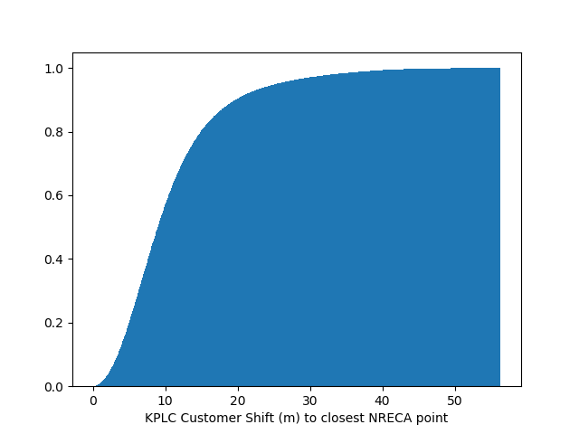

## Individual Electricity Prediction

### Distribution of customer location shifts due to structure location correction
Given a customer location (**A**), we compute the distance (meters) between point **A** and the closest structure (**B**). The distribution of distances is shown below.

  

